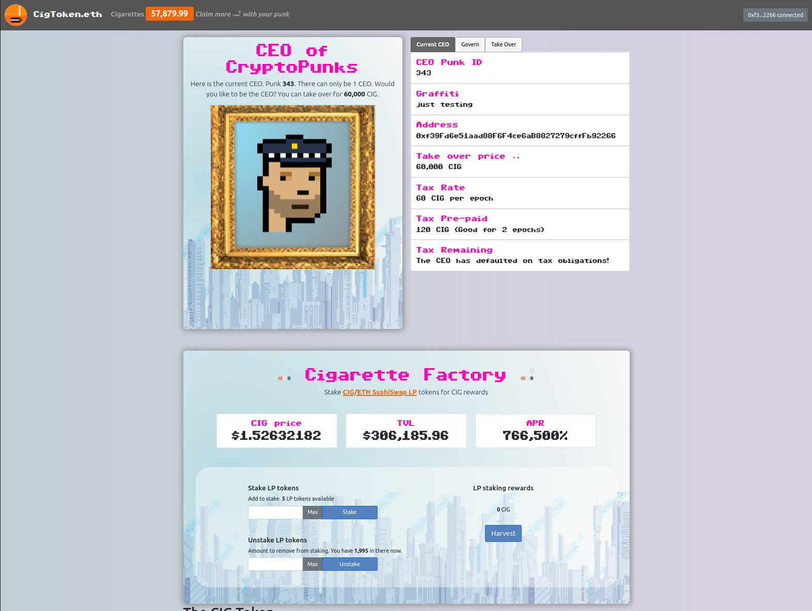

# PUNKS CEO (and "Cigarette" token)


## Executive Summary
                                           
If you have a punk, then use it to claim 100,000 Cigarettes. These can be used to buy the CEO title to become the CEO of the CryptoPunks. The CEO title comes with two perks: ability to set a "graffiti" message and the ability to increase or decrease the issuance rate of CIG itself. You can also set what price the CEO title will cost. Be careful, anybody else can take your CEO title by buying it. Set the price too low, and someone will take it, set it too high, and you would need to pay a higher tax. Each time the title is bought, the tokens will be burned. (This is what's known as a harberger tax)

Optionally, there is a DeFi farm, where you can earn CIG rewards by supplying liquidity for the CIG token on a decentralized exchange.



WEB: punksCEO.eth.limo

IPFS: punksCEO.eth

Token Address: cigtoken.eth

### THE RULES

1. Anybody can buy the CEO title at any time using Cigarettes. (The CEO of all cryptopunks)
2. When buying the CEO title, you must nominate a punk, set the price and pre-pay the tax.
3. The CEO title can be bought from the existing CEO at any time.
4. To remain a CEO, a daily tax needs to be paid.
5. The tax is 0.1% of the price to buy the CEO title, to be charged per epoch.
6. The CEO can be removed if they fail to pay the tax. A reward of CIGs is paid to the whistleblower.
7. After Removing a CEO: A dutch auction is held, where the price will decrease 10% every half-an-epoch.
8. The price can be changed by the CEO at any time. (Once per block)
9. An epoch is 7200 blocks.
10. All the Cigarettes from the sale are burned.
11. All tax is burned
12. After buying the CEO title, the old CEO will get their unspent tax deposit refunded

### CEO perk

13. The CEO can increase or decrease the CIG farming block reward by 20% every 2nd epoch!
However, note that the issuance can never be more than 1000 CIG per block, also never under 0.0001 CIG.
14. THE CEO gets to hold a NFT in their wallet. There will only be ever 1 this NFT.
The purpose of this NFT is so that everyone can see that they are the CEO.
IMPORTANT: This NFT will be revoked once the CEO title changes.
Also, the NFT cannot be transferred by the owner, the only way to transfer is for someone else to buy the CEO title! (Think of this NFT as similar to a "title belt" in boxing.)

END

* states
* 0 = initial
* 1 = CEO reigning
* 2 = Dutch auction
* 3 = Migration state

Notes

It was decided that whoever buys the CEO title does not have to hold a punk and can nominate any punk they wish.
This is because some may hold their punks in cold storage, plus checking ownership costs additional gas.
Besides, CEOs are usually appointed by the board.

### Tokenmics and issuance: 

1 billion CIG will be minted at deployment and sent to the autonomous CryptoPunks contract, ready for claiming.

When claiming the airdrop, 100K CIG will be sent from the CryptoPunks contract to each claimant.

There will be no time limit for the airdop.

The issuance will be 1000 CIG per block at the beginning. The CEO will be able to change it by 20% after
every 14400 blocks. The result of the change must always be between 1000 and 0.0001 CIG. This means
that the issuance can never be more than 1000 per block, or less than 0.0001 CIG per block.

There is no tax or fee on transfers or trading. The game element is completely optional.

No Admin keys / "team allocations" / VCs. (The Admin keys are used for deployment and burned after)

### Credits
- LP Staking based on code from SushiSwap's MasterChef.sol
- ERC20 & SafeMath based on lib from OpenZeppelin 

### Versions, disclosure and bugs

This branch removes a vulnerability discovered and disclosed by https://twitter.com/alphasoups (The vulnerability was with the MasterChefV2 callback implementation)

The `old-cigtoken-deployed-contract` branch contains the old cig.sol version which was deployed.

Fortunately, the deployed OLD cig token contract was not exploitable in its current state, (The exploit was with the MasterchefV2 callback, and a PoC is given in `test/exploit-test`). The old cig token contract has since been abandoned.

The currently deployed version, 2.0 at address `cigtoken.eth` contains a bug with the `withdraw(uint256)` function. The function incorrectly uses `transferFrom` where `transfer` should have been used, causing it to fail. As a workaround, the UI uses `emergencyWithdraw()` which is a backup withdrawal function. IMPORTANT: The `emergencyWithdraw()` function will forefit any accumulated CIG rewards, so it's importnat that the `harvest()` function is called shortly before calling `emergencyWithdraw()`  

A further workaround could be applied by developing a separate rewards distributor contract.

#### version 2.0 (currently deployed)
- added token migration functionality to complete migration to a new contract
- changed _caclDiscount() to apply discounts in groups of blocks rather than continuous per block discount
- introduced the withdraw() bug

branch name: `v2-currently-deployed`

#### version 2.1
- fixed the withdraw bug (use transfer instead of transfer from)
- changed _caclDiscount() back to old functionality, applying per block discount
- update tests in test/full-test.js to point new contract

# Dev notes

To run tests

``` 
$ npm install --save-dev hardhat
$ npx hardhat test
```

Using node 17 and getting a strange 'envelope' error?

```
export NODE_OPTIONS=--openssl-legacy-provider
```

To run migration tests only

```
npx hardhat test test/migration-test.js
```

end